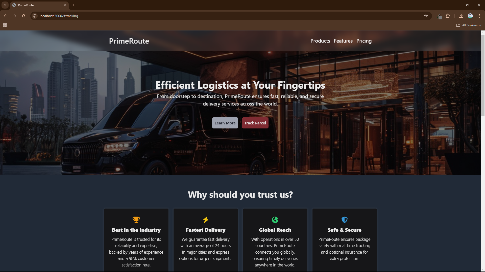

# PrimeRoute

PrimeRoute is a responsive web application for a faux shipping services, 
real-time parcel tracking, and FAQs. It uses HTML, CSS, JavaScript, and Mapbox.

## Description

PrimeRoute is a project that demonstrates the use of third-party APIs to 
retrieve location. The main objective is to integrate various APIs to provide the
users current location as a 'parcel'.

---

## Features

- Integration with third-party mapping APIs
- Real-Time location
- User-friendly interface
- Responsive Design

---

## Screenshot

---

## Acknowledgements

- Thanks to @myles-reid for the help building this
- Special thanks to the contributors of the third-party APIs used in this project.

---

### Technologies used

  
  
  
   

